# Software Architecture Practice Exercises - Week 6: DOCKERFILE

## Submission Information

- **Full Name**: Dương Hoàng Lan Anh
- **Student ID**: 21087481

---

## Phần I: Các lệnh cơ bản thao tác với Docker

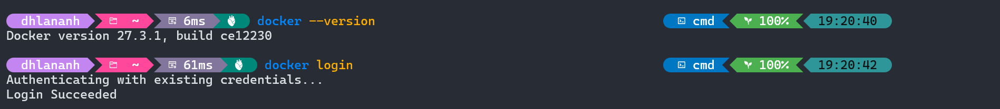

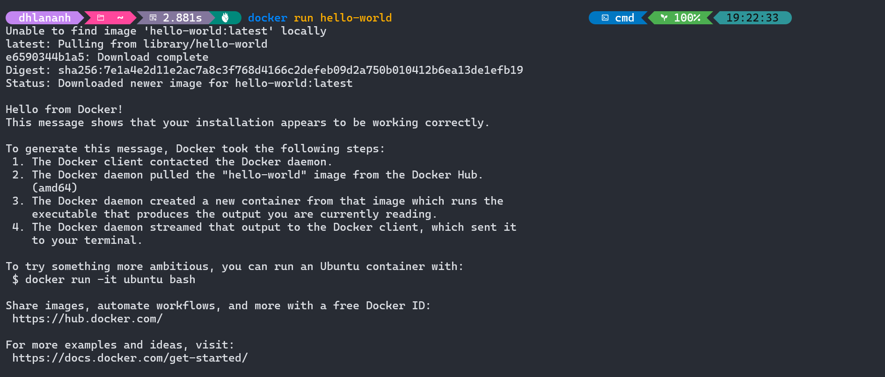

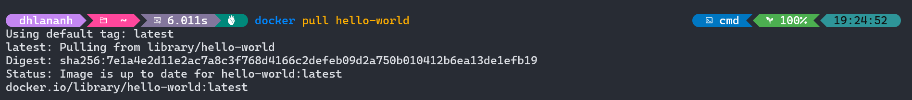

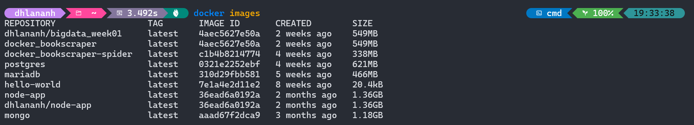

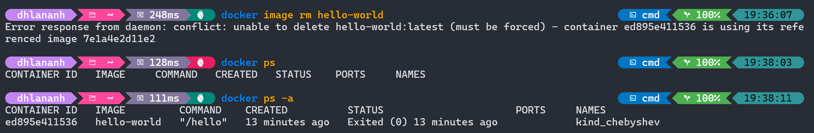

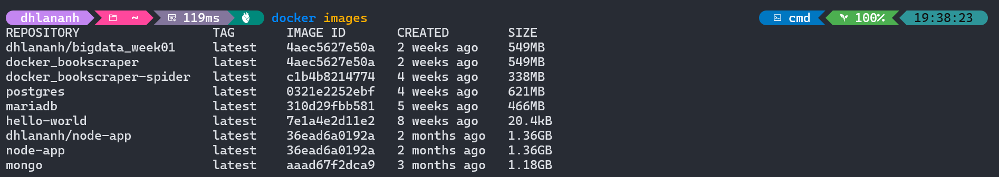

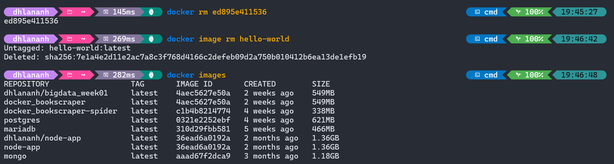

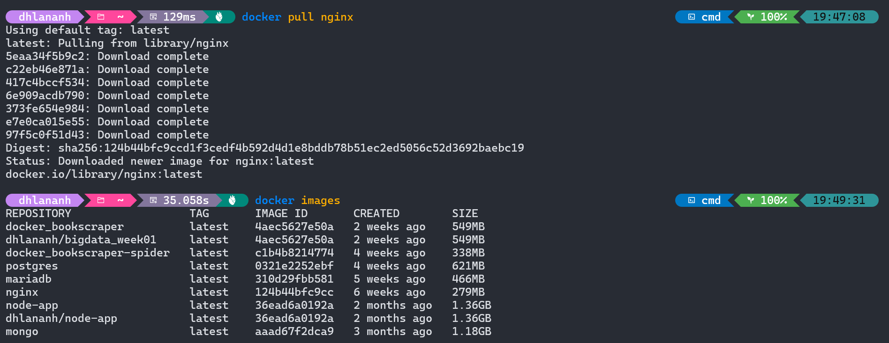

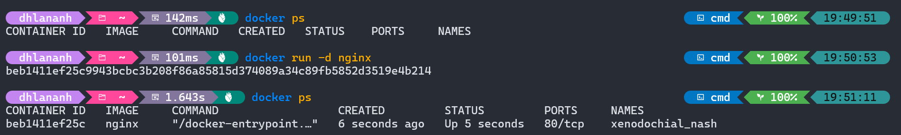

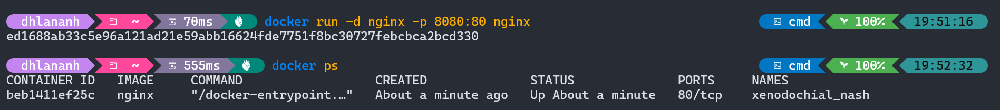

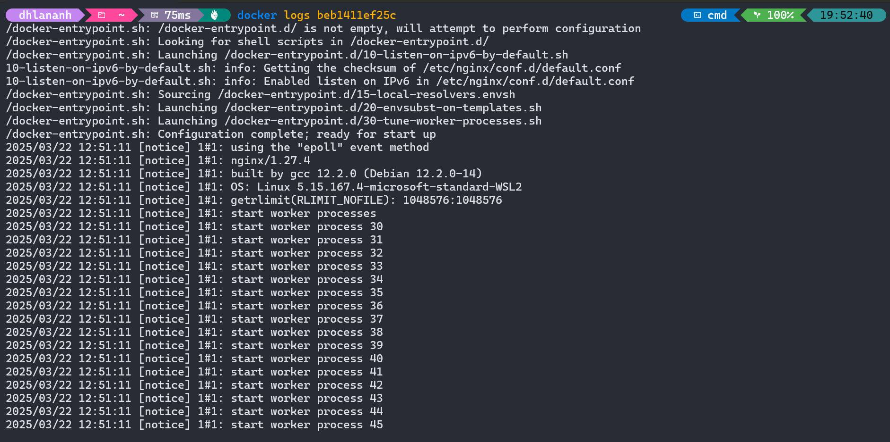

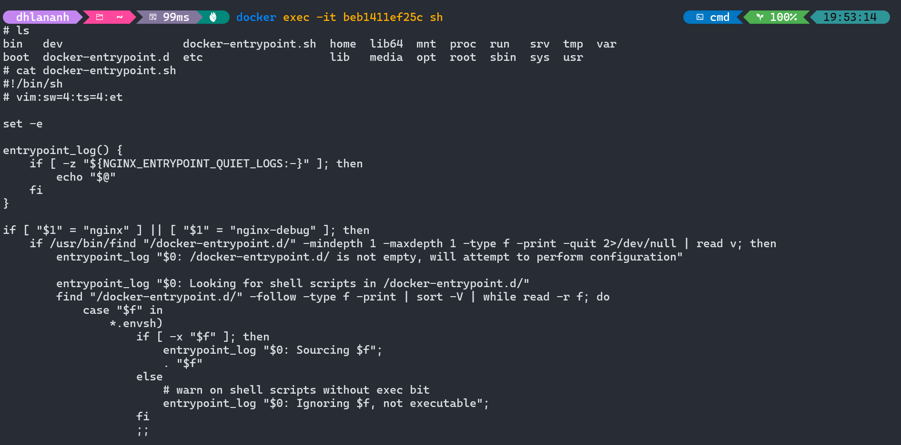

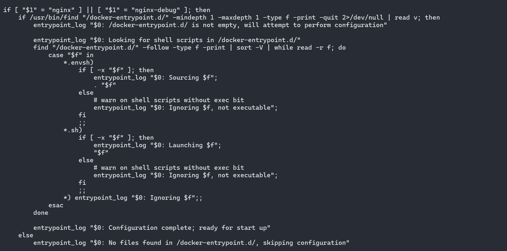

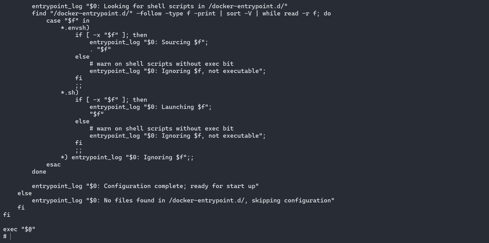

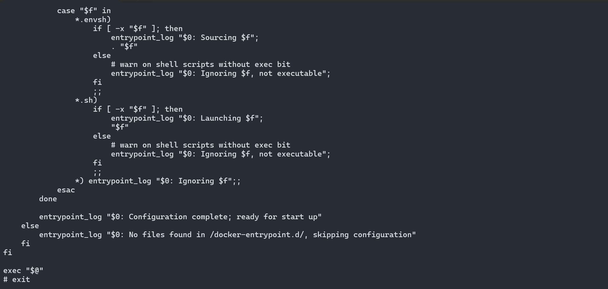

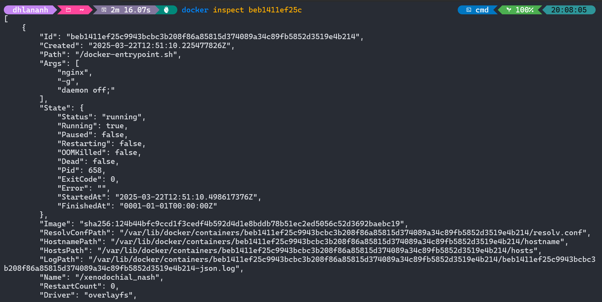

---

## Phần II: Thao tác với Dockerfile

### Exercise 01: Create a Dockerfile to run a simple Node.js application

#### Build Docker Image

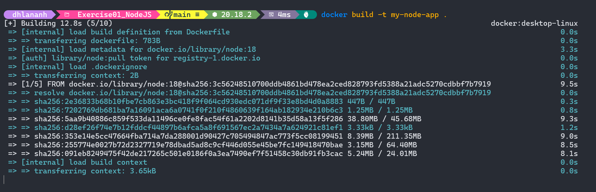

#### Run Docker Container

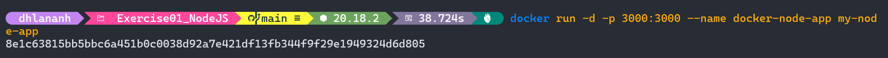

#### Test

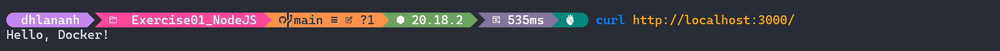

#### Stop Docker Container

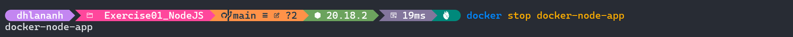

### Exercise 02: Create a Dockerfile to run a Python Flask application

#### Build Docker Image

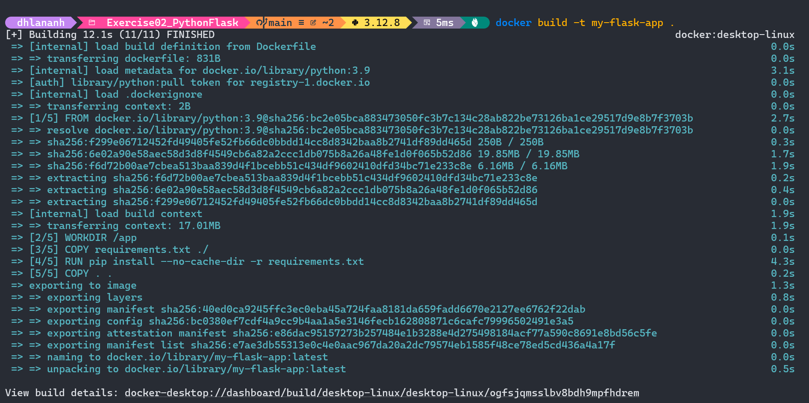

#### Run Docker Container

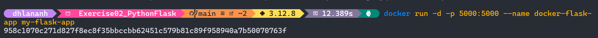

#### Test

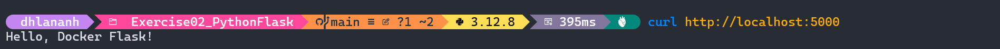

#### Stop Docker Container

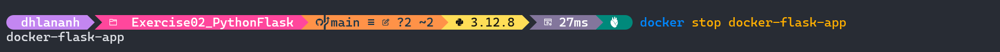

### Exercise 03: Create a Dockerfile to run a React application

#### Build Docker Image

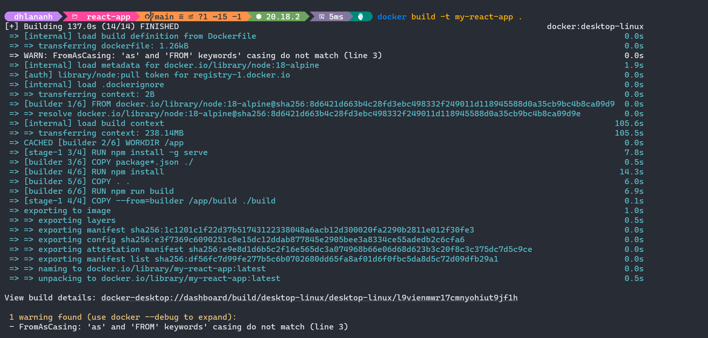

#### Run Docker Container

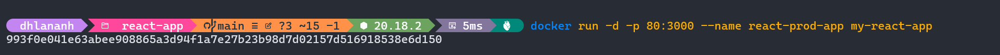

#### Test

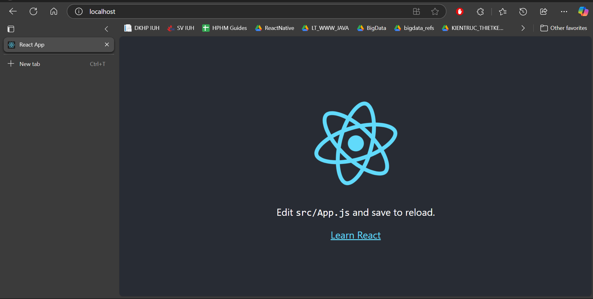

#### Stop Docker Container

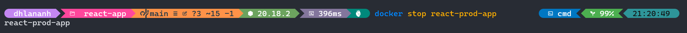

### Exercise 04: Create Dockerfile to run a static website using Nginx

#### Build Docker Image

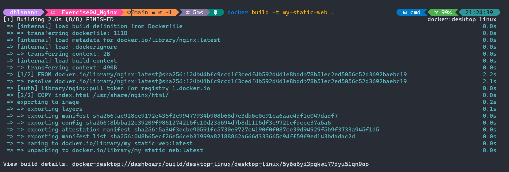

#### Run Docker Container

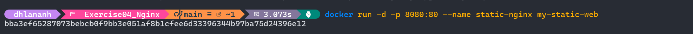

#### Test

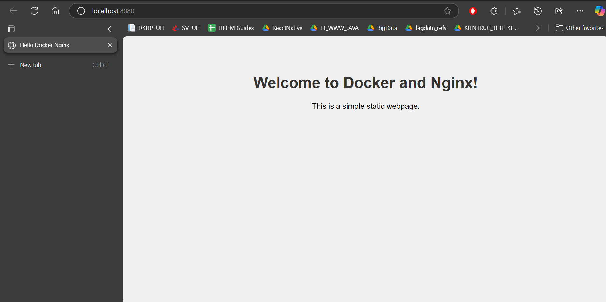
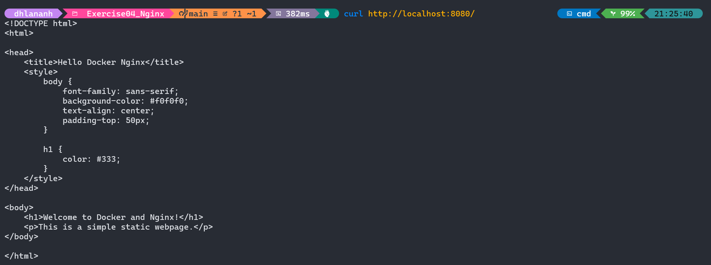

#### Stop Docker Container

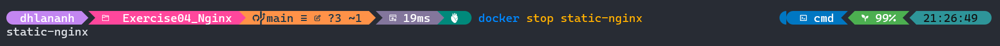

### Exercise 05: Create Dockerfile to run Go application

#### Build Docker Image

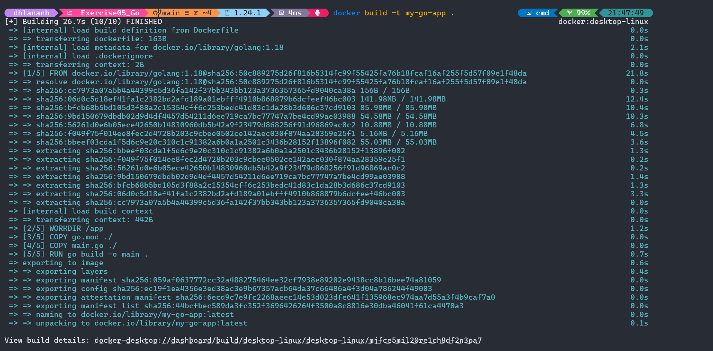

#### Run Docker Container

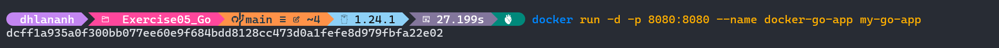

#### Test

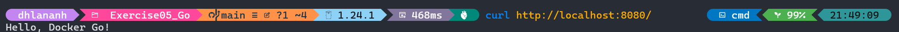

#### Stop Docker Container

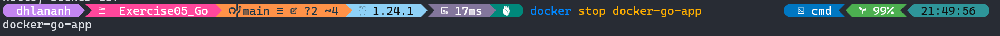
